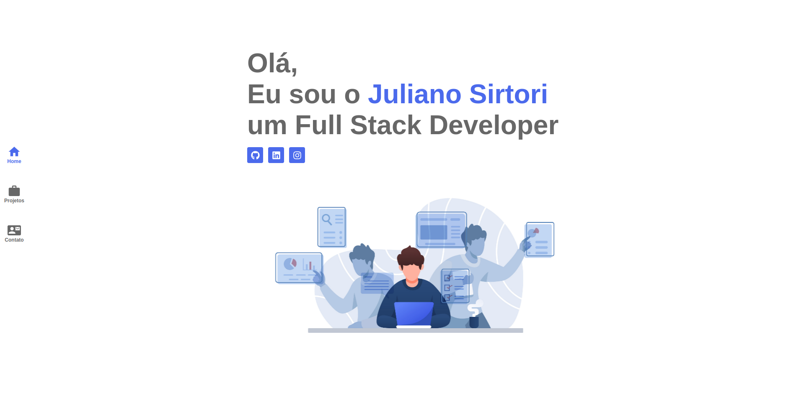

# Portifolio



## Running Locally


```sh
# Step 1
git clone git@github.com:julianosirtori/Portfolio.git

# Step 2
cd Portfolio

# Step 3
yarn install

# Step 4
yarn start

Runs the app in development mode.<br>
Open [http://localhost:3000](http://localhost:3000) to view it in the browser.